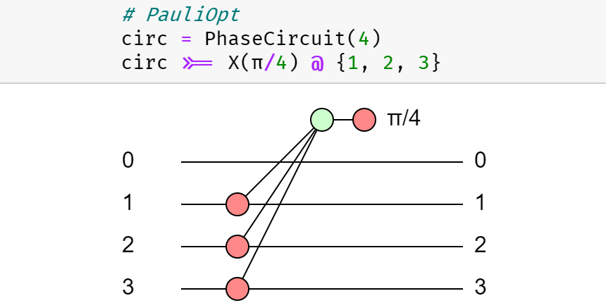
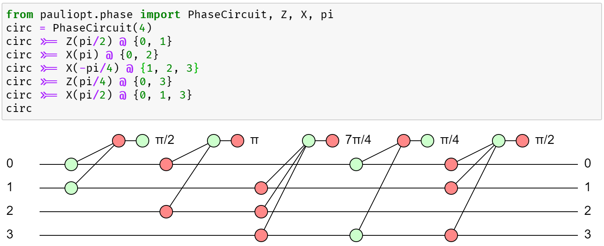
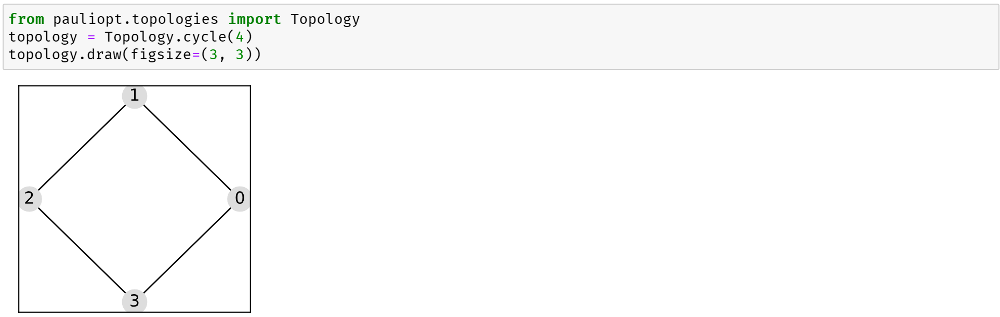
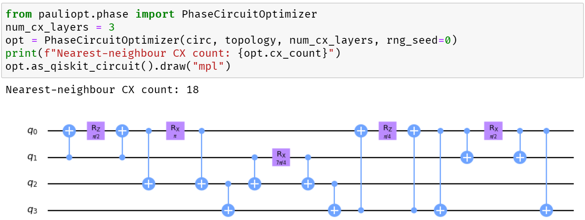
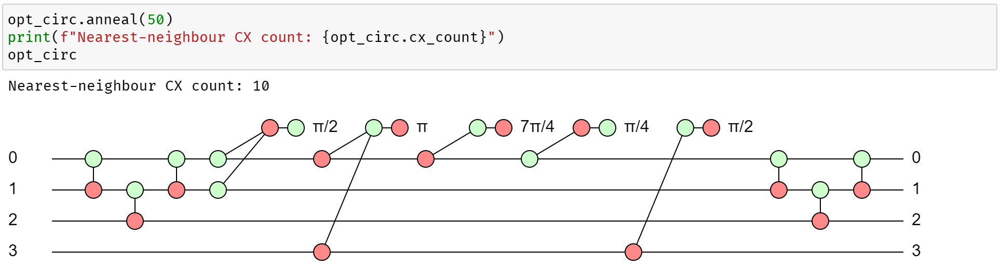

# PauliOpt: A Python library to simplify quantum circuits.
[](https://docs.python.org/3.8/)
[](https://github.com/python/mypy)
[](https://pypi.python.org/pypi/pauliopt/)
[](https://pypi.python.org/pypi/pauliopt/)
[](https://hashberg.io/)

PauliOpt is a Python library to simplify quantum circuits composed of phase and Pauli gadgets.



The [documentation](https://sg495.github.io/pauliopt/pauliopt/index.html) for this library was generated with [pdoc](https://pdoc3.github.io/pdoc/).
Jupyter notebooks exemplifying various aspects of the library are available in the [notebooks](./notebooks) folder.

**Please Note:** This software library is in a pre-alpha development stage. It is not currently suitable for use by the public.

You can install the library with `pip`:

```
pip install pauliopt
```

If you already have the library installed and would like the latest version, you can also upgrade with `pip`:

```
pip install --upgrade pauliopt
```

## Optimization of Circuits of Mixed ZX Phase Gadgets

**Step 1.** Create a circuit of Z and X phase gadgets.



**Step 2.** Select the desired qubit topology.



**Step 3.** Instantiate an optimizer for the desired circuit and topology.



**Step 4.** Run a few iterations of simulated annealing and look at the simplified circuit.



## Unit tests


To run the unit tests, install the additional requirements using our `requirements.txt` (recommended python: 3.9), then to launch then, run:

```bash
python -m unittest discover -s ./tests/ -p "test_*.py"
```